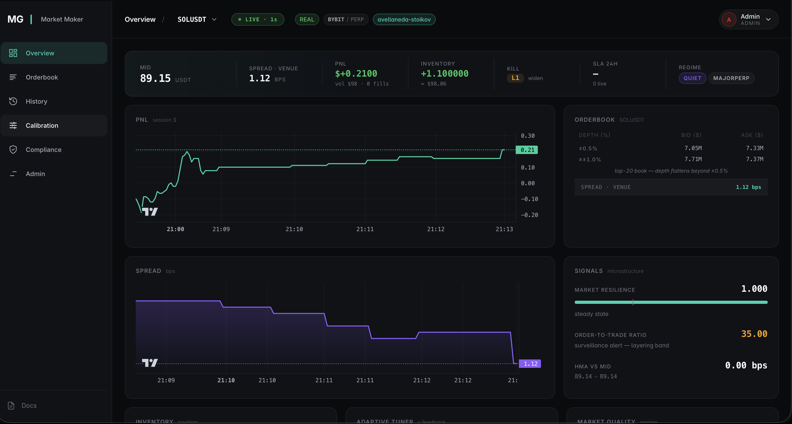

<p align="center">
  <h1 align="center">MG Market Maker</h1>
  <p align="center">
    <strong>Production-grade algorithmic market making engine written in Rust</strong>
  </p>
  <p align="center">
    <a href="#quick-start">Quick Start</a> &bull;
    <a href="docs/guides/quickstart.md">Full Guide</a> &bull;
    <a href="docs/guides/writing-strategies.md">Write a Strategy</a> &bull;
    <a href="docs/guides/configuration-reference.md">Config Reference</a> &bull;
    <a href="docs/guides/architecture.md">Architecture</a>
  </p>
</p>

<p align="center">
  
  
  
  
  
  
</p>

<p align="center">
  
</p>

---

High-performance, multi-venue market making engine with institutional-grade risk management, toxicity detection, and MiCA compliance. `Decimal` arithmetic everywhere — never `f64` for money. 25 crates, 157K lines, 2241 tests.

Runs as a **server + agent split**: one `mm-server` (controller + dashboard + vault) central, one or more `mm-agent` processes (trading engine) per colo / venue region. Single-machine dev = both on one host. Agents connect over mTLS-capable WebSocket, lease-gated, admission-controlled by the controller.

## Why MG?

| | MG Market Maker | Hummingbot | Freqtrade | NautilusTrader |
|---|:---:|:---:|:---:|:---:|
| **Language** | Rust | Python | Python | Rust+Python |
| **Strategies** | 9+ (A-S, GLFT, Grid, Basis, XEMM, FundingArb, StatArb, PairedUnwind, ExecAlgos) | 5 | 3 | 4 |
| **Venues** | 4 × dual-product (Binance spot+USDM futures, Bybit spot+linear+inverse, HyperLiquid spot+perps, Custom) | 20+ | 10+ | 5 |
| **Latency** | ~2us/quote | ~1ms | ~10ms | ~50us |
| **Kill Switch** | 5-level auto-escalation + typed-echo confirm | Manual | No | No |
| **Toxicity (VPIN/Kyle/AS)** | Built-in | No | No | No |
| **MiCA Audit Trail** | JSONL + SHA-256 hash chain + HMAC signed export | No | No | No |
| **Portfolio Risk** | Factor VaR + correlation matrix + Markowitz hedge | No | No | Partial |
| **Multi-Client** | Per-client isolation + SLA certificates | No | No | No |
| **FIX 4.4** | Session engine + codec | No | No | Partial |
| **Adaptive Calibration** | PairClass templates + hyperopt recalibrate flow | No | No | No |
| **Auth Surface** | Role-gated (Admin/Operator/Viewer), HMAC tokens, audited login/logout | Basic | No | Basic |

## Features

<details>
<summary><b>Quote strategies</b> — tick-synchronous quote producers (drop-in for any Strategy.* graph node)</summary>

- **Avellaneda-Stoikov** — optimal spread with inventory skew (γ / κ / σ)
- **GLFT** — Guéant-Lehalle-Fernandez-Tapia with live order-flow calibration
- **Grid** — symmetric grid quoting around mid
- **Basis** — spot + reference-price shift from a hedge leg
- **Basis Arb** — paired spot-vs-futures spread entry/exit
- **Cross-Exchange** — make on venue A, hedge on venue B
- **XEMM** — cross-exchange executor with slippage band + inventory cap
- **Inventory Skew** — quadratic skew + dynamic sizing + urgency unwinding

</details>

<details>
<summary><b>Async drivers</b> — fire atomic multi-leg dispatches on their own tokio task</summary>

- **Funding Arb Driver** — atomic spot-perp funding-rate arbitrage with compensating-reversal on pair break + uncompensated-break counter
- **Stat Arb Driver** — cointegrated pairs: Engle-Granger + Johansen + Kalman + z-score, screener + signal + driver
- **Campaign Orchestrator** — multi-leg campaign scheduler on top of the execution algos
- **Paired Unwind** — L4 kill-switch flatten for paired basis / funding positions
</details>

<details>
<summary><b>Execution algos</b> — plug into any Strategy as a sink-side executor</summary>

- **TWAP** — time-weighted with slice count + duration config
- **VWAP** — volume-weighted with duration config
- **POV** — percent-of-volume target
- **Iceberg** — display-qty chunking with hidden reserve
- **Ignite** — burst executor (single-tick depth sweep)
- **Mark / Layer** — laddered price-marker placement
- **Foreign TWAP** — cross-venue slow liquidator for imbalanced inventory
- **Order Emulator** — client-side OCO / GTD / trailing / stop-loss above venues that don't support them natively
</details>

<details>
<summary><b>Alpha signals + modulators</b> — stack on any quote producer</summary>

- **Book imbalance**, **trade flow**, **microprice**, **HMA slope**
- **CKS OFI** — Cont-Kukanov-Stoikov L1 order-flow imbalance
- **Learned microprice** — Stoikov 2018 G-function histogram fit
- **Cartea adverse-selection spread** — closed-form with decimal-ln helper
- **Market resilience** — event-driven shock detector + recovery score
- **Volatility** — EWMA realised-vol estimator
- **Autotune** — regime-conditional γ / size modulator (Quiet / Trending / Volatile / MeanReverting)
- **Adaptive Tuner** — online rolling-fill-rate feedback controller, bounded γ factor
- **Pair-class templates** — MajorSpot / AltSpot / MemeSpot / MajorPerp / AltPerp / StableStable with per-class defaults
- **Mark price**, **AB Split** — time-based or symbol-based experiment routing
</details>

<details>
<summary><b>Surveillance + pentest</b> — 15 manipulation patterns, detector + exploit pairs</summary>

Each pattern ships **two halves**:

- a **detector** that scores the live book/trade stream (surfaced on
  DeploymentDrilldown and the fleet surveillance rollup),
- an **exploit** that lives behind `MM_ALLOW_RESTRICTED=yes-pentest-mode`
  + a typed-echo deploy-time acknowledgement.

Current pairs: **Spoofing**, **Pump-and-Dump**, **Wash Trading**,
**Thin-Book**, **Layering**, **Liquidation Cascade**, **Basket Push**,
**Rug Detector**, **Rave Cycle** (+ full campaign), plus the catch-all
`exploits.rs` pattern bank.

6 pentest templates + 1 defender (`rug-detector-composite`) live under
`crates/strategy-graph/templates/pentest/`. Deploys refuse unless the
operator explicitly acknowledges the restricted-node list.

See **[Pentest Guide](docs/guides/pentest.md)**.
</details>

<details>
<summary><b>Strategy Graph</b> — visual builder with 100+ node kinds, live overlay, replay, versioning</summary>

Drag from the palette, wire, deploy. No Rust required.

- **Sources** — Book.L1 / Book.Depth / Trade.Tape, sentiment feeds
  (news, social, on-chain holder flow), per-venue funding state,
  portfolio inventory / balance, risk metrics (VPIN, Kyle λ, OTR)
- **Math / Stats / Logic** — arithmetic, EWMA, constants, comparators,
  cast-to-bool, pair-class / strategy-name equality
- **Indicators** — SMA, EMA, HMA, RSI, ATR, Bollinger
- **Risk nodes** — ToxicityWiden, InventoryUrgency, CircuitBreaker,
  Cost.Sweep, Risk.UnrealizedIfFlatten
- **Strategy blocks** — Avellaneda, GLFT, Grid, BasisCarry, BasketPush,
  plus `-via-graph` carrier nodes
- **Execution algos** — TwapConfig / VwapConfig / PovConfig / IcebergConfig
- **Plan nodes** — Plan.Accumulate / Plan.Distribute
- **Sinks** — `Out.SpreadMult`, `Out.QuoteOverride`, `Out.KillEscalate`

14 bundled templates: `avellaneda-via-graph`, `glft-via-graph`,
`grid-via-graph`, `basis-carry-spot-perp`, `cross-exchange-basic`,
`xemm-reactive`, `funding-aware-quoter`, `cross-asset-regime`,
`cost-gated-quoter`, `liquidity-burn-guard`, `meme-spot-guarded`,
`major-spot-basic`, `rug-detector-composite`, plus 6 pentest patterns.

**Live mode** overlays per-tick values on every edge, flags dead nodes,
pulses active sinks, and tracks hit rate. Pin a tick for time-travel.
**Replay vs deployed** runs your canvas against the last 20 ticks of
a live deployment and counts divergences side-by-side.

Custom graphs persist as versioned JSON (diff preview, rollback to any
prior version) under `data/strategy_graphs/` on the controller.

See **[Graph Authoring](docs/guides/graph-authoring.md)**.
</details>

<details>
<summary><b>Risk management</b> — 5-level kill switch + ~35 risk modules</summary>

**Kill ladder (per-deployment, escalates + auto-reset)**
- L1 Widen Spreads → L2 Stop New → L3 Cancel All → L4 Flatten (TWAP) → L5 Disconnect
- Typed-echo confirm for L3+ destructive ops
- Flatten preview: book-depth cover check + slippage estimate

**Real-time guards**
- **VPIN** + **Kyle's Lambda** — toxicity, auto spread widening
- **Circuit Breaker** — stale book, wide spread, max drawdown, max exposure
- **Stop-Loss Guard** / **Cooldown** / **Max Drawdown** / **Low-Profit Pairs** — from Freqtrade-style protections
- **Lead-Lag Guard** — EWMA z-score on leader-venue mid → soft widen
- **News Retreat** — 3-class headline state machine + cooldowns
- **Social Risk** — FUD / FOMO ticks degrade aggressiveness
- **Volume Limit**, **Market Impact** — per-window notional caps
- **Margin Guard** — perp margin utilisation thresholds

**Portfolio level**
- Factor delta limits, cross-symbol VaR, correlation matrix
- **Hedge Optimizer** — Markowitz mean-variance cross-asset hedge
- **Per-Strategy VaR Guard** — parametric Gaussian, EWMA, 99% breach → throttle
- **Per-Client Circuit** — tenant-scoped cut-off on breach
- **Portfolio Balance** — cross-venue inventory aggregator + rebalancer
- **Decision Ledger** — every quote/cancel decision stamped with the rule that fired

**Accounting + reconciliation**
- **Inventory Drift Reconciler** — tracker vs wallet divergence, 60s cycle
- **Reconciliation** — fleet-wide order + balance match vs exchange, ghost / phantom / fetch-fail reporting
- **PnL Attribution** — spread / inventory / rebates / fees
- **OTR** — Order-to-Trade Ratio (MiCA surveillance metric)
- **SLA** — per-minute presence buckets, spread compliance, two-sided obligation
- **Session Calendar** — per-venue maintenance windows, auto-pause
- **Loan Utilization** — token-lending cost amortisation
- **DCA** — position-adjustment planner (flat / linear / accelerated)
- **Liquidation Heatmap** — perp liquidation-level probe
- **Borrow** — borrow-cost surcharge state machine
- **Manipulation detectors** — per-symbol score surfaced on DeploymentDrilldown
- **Performance** — rolling Sharpe / Sortino / Calmar / MaxDD telemetry
</details>

<details>
<summary><b>Exchange connectivity</b> — 5 venues, spot + derivatives, WS order entry, FIX 4.4</summary>

Every venue supports both spot and derivatives (where the venue
itself does). Each product-type is a separate connector instance so
an engine can run `binance_spot + binance_futures + bybit_spot +
bybit_linear + hyperliquid_spot + hyperliquid_perp` side-by-side.

- **Binance** — spot + USDM futures. WS API order entry, listen-key user data, batch orders, `LIMIT_MAKER` for post-only. Clock-skew preflight catches `-1021` before startup.
- **Bybit V5** — spot + linear (USDT-M) + inverse (coin-margined) perps. Unified category-parametrised API, batch 20, native amend, WS Trade.
- **HyperLiquid** — spot + perps. EIP-712 signing (secp256k1), WS post. USDC-only collateral.
- **Coinbase Prime (FIX 4.4)** — institutional venue via the shared FIX session engine.
- **Custom Exchange** — full REST + WS connector.
- **Shared protocol layer** — one WS-RPC abstraction, many adapters. FIX 4.4 codec + session engine lives under `crates/protocols/fix`.
- **Cross-venue SOR** — Smart Order Router with inline dispatch, trade-rate governor, per-venue state machine.
- **Listing Sniper** — new-symbol discovery via `list_symbols` polling.

**[Adding a new exchange](docs/guides/adding-exchange.md)** — implement one trait, 8 steps.
</details>

<details>
<summary><b>Vault + agent fleet</b> — encrypted multi-kind secret store, admission-gated agent control plane</summary>

- **Vault** — AES-256-GCM encrypted-at-rest store for every secret type:
  exchange credentials, Telegram tokens, Sentry DSNs, webhook URLs, SMTP
  credentials, on-chain RPC keys, arbitrary generic values. Allowed-agents
  whitelist per credential. "No reveal" rule — rotate = new value.
- **Agent admission** — Pending → Accepted → (Revoked | Rejected) state
  machine, persisted across controller restarts. Pre-approve flow lets
  admin paste a fingerprint before the agent first connects.
- **Tenant isolation** — `profile.client_id` on every agent; credentials
  tagged for a tenant only resolve against matching agents. Cross-tenant
  leak gated at deploy time.
- **Lease-gated WS** — every agent session holds a refreshable lease;
  controller restart replays persisted approvals so live agents don't
  need re-approval.
- **Fleet ops** — pause/resume fleet, batch deploy, retire individual
  deployments, revoke agent with in-flight cancel-all.
</details>

<details>
<summary><b>Multi-client + compliance</b> — per-client isolation, MiCA audit, SLA tracking, client portal</summary>

- **Multi-client isolation** — each tenant owns symbols with separate
  PnL, fills, webhooks, API auth. `ClientReader` role sees a dedicated
  Client Portal: PnL, SLA, signed certificate download, self-service
  webhook CRUD + test-fire, delivery log.
- **MiCA audit trail** — append-only JSONL, microsecond timestamps, 5-year
  retention, **SHA-256 hash chain** (tamper-evident, restart-safe),
  HMAC-signed export. fsync on critical events (OrderFilled,
  KillSwitchEscalated, CircuitBreakerTripped).
- **MiCA HMAC full-body signature** — reports sign the full UnsignedReport
  (period, strategy, OTR, risk controls, SLA, timestamp), constant-time
  verify.
- **SLA tracking** — per-minute presence buckets, spread compliance,
  two-sided quoting obligation.
- **SLA certificates** — HMAC-signed JSON, downloadable from client
  portal.
- **Article 17 report** — algorithmic trading report template.
- **Monthly report job** — auto-generated PDF per tenant on a
  `tokio-cron-scheduler` cadence, archived to S3.
- **Token lending** — loan agreements, utilisation tracking, return
  schedules, PnL cost amortisation, per-loan transfer log.
- **Webhook delivery** — per-client event routing (SLA breach, kill
  switch, large fill, reports). Fleet-wide delivery log with latency
  percentiles, retry + delivery log.
- **Violations panel** — unified watch list across SLA / kill / recon /
  manipulation streams with hide / pause / widen / open-incident actions.
- **Incidents** — persistent incident tracker (ack → resolve workflow,
  post-mortem scaffold, graph-tick deep link from any fired violation).
- **Archive pipeline** — S3 bundle shipper (`aws-sdk-s3` 1.x,
  behavior-version-latest, default-https-client backend).
</details>

<details>
<summary><b>Sentiment + on-chain signals</b> — feed into any Strategy node</summary>

- **Sentiment orchestrator** — per-ticker tick bus for news + social +
  keyword + LLM-classifier signals. RSS collector + Ollama classifier
  shipped; plug in custom sources.
- **On-chain tracker** — holder concentration, large transfer flow, via
  Alchemy / Etherscan / Moralis / Goldrush adapters. Cached per-token so
  graph nodes read cheaply.
- **Headline state machine** — News.Retreat turns "Bad headline for TKR"
  into a bounded quote-widen + optional pause window.
</details>

<details>
<summary><b>Dashboard & Auth</b> — Svelte 5, role-gated, audited, WCAG AA, fork-to-rebrand</summary>

- **Svelte 5 runes** — modern reactivity (`$state`, `$derived`, `$effect`, `$props`)
- **Design system** — `tokens.css` (108 CSS variables) + `primitives/` (Button, Modal, Chip, StatusPill, FormField, DataGrid, EmptyState, StatTile). Every component is tokens-only — a design-system linter gates 8 invariants on every PR (no hex in primitives, no utility-class leaks, no product-name hardcodes)
- **Fork-to-rebrand** — swap `branding.js` + `tokens.css` + `public/logo.svg` and you have a white-label dashboard. See [Rebranding guide](docs/guides/rebranding.md)
- **Visual strategy builder** — drag-and-drop graph authoring with live-mode value overlay, replay vs deployed, version history + diff. `StrategyPage`, powered by `svelte-flow` + `strategy-graph` crate
- **Fleet page** — every connected agent with approval state, lease TTL, deployments, retire + revoke flows, batch deploy
- **Per-deployment drilldown** — adaptive state, kill ladder ops, feature flags, live tuning, funding-arb driver events, flatten preview with book-depth cover check
- **Role-based auth** — Admin / Operator / Viewer / ClientReader; HMAC-signed 24h Bearer + X-API-Key header
- **Login / logout audited** — `LoginSucceeded` / `LoginFailed` / `LogoutSucceeded` rows in MiCA trail with source IP + user_id / key prefix
- **IP rate-limit on login** — 20/min per source IP; timing-equalised response to deny key-membership oracle
- **Typed-echo kill confirmation** — operator must type `{symbol} {action}` for L3/L4 destructive ops
- **Stale-data indicators** — every WS payload stamped with `_rx_ms`; freshness pill shows fresh (≤2s green) / stale (≤5s amber) / frozen (>5s red pulse)
- **WCAG AA** — muted text passes AA contrast; `prefers-reduced-motion` handler; `:focus-visible` default ring
- **Preflight** — clock-skew (±500 ms / ±2000 ms budgets), rate-limit budget, venue server time, exchange info, balance sanity — fails live startup on hard errors
</details>

<details>
<summary><b>Backtesting & Optimization</b> — replay, probabilistic fills, hyperopt</summary>

- **Event Replay** — JSONL recorded data through strategy simulator
- **Probabilistic Fill Model** — queue position, slippage, latency (seeded ChaCha8 RNG)
- **Lookahead-Bias Detector** — catches data leaks in indicators
- **Hyperopt** — random search + differential evolution with Sharpe/Sortino/Calmar/MaxDD loss
- **Parameter Calibration** — GO / NEEDS_MORE_DATA / UNPROFITABLE recommendations
- **A/B Testing** — time-based or symbol-based split, per-variant performance tracking
- **Demo Data Generator** — synthetic events with configurable volatility + mean-reversion
</details>

<details>
<summary><b>Operations & monitoring</b> — Prometheus, Telegram, hot reload, distributed smoke harness, design-system linter</summary>

- **Prometheus gauges** — 28+ `mm_*` metrics: PnL, spread, inventory, VPIN, Kyle λ, SLA, VaR, fill slippage, portfolio risk, per-deployment telemetry. See **[Metrics Glossary](docs/guides/metrics-glossary.md)**.
- **Telegram** — two-way: alerts (3-level severity + dedup) + commands (`/status`, `/stop`, `/pause`, `/force_exit`).
- **Alerting** — fleet-wide dedup across agents, webhook dispatch per client + severity routing.
- **Hot config reload** — admin-only `/api/admin/strategy/graph/{name}/nodes/{node_id}/config`; live PATCH /variables on any deployment, optimistically merged locally.
- **Pre-flight** — clock-skew (±500ms / ±2000ms budgets), rate-limit budget, venue server time, exchange info, balance sanity. Fails live startup on hard errors.
- **Distributed smoke harness** — `scripts/distributed-smoke.sh` spins mm-server + mm-agent, walks the full handshake, deploys a graph, verifies 10+ downstream endpoints populate — 90s–5min runs.
- **Design-system linter** — `scripts/lint-design-system.sh` gates 8 frontend invariants on every PR.
- **Playwright e2e** — navigation smoke + role-gate checks against the running stand (CI job).
- **Graceful shutdown** — Ctrl+C → cancel-all → final reports → checkpoint flush → exit.
- **Crash recovery** — checkpoint restore (opt-in), fill-replay from audit log, orphaned-order cancel on restart.
- **Health state machine** — Normal / Degraded / Critical, auto spread widening on venue errors.
- **Market data recording** — `record_market_data = true` for offline backtesting.
- **OpenTelemetry** — opt-in `--features otel` build: request/tick spans to OTLP gRPC collector. Sentry hook lands on panic.
</details>

## Quick Start

The system is a **server + agent split**. Exchange credentials live in
the server's encrypted Vault (never in env vars). An agent dials the
server, gets accepted by an admin, receives a lease, pulls credentials,
and runs deployments authored by the operator on the dashboard.

### 1. Build + boot the controller

```bash
git clone https://github.com/iZonex/mg-market-maker.git
cd mg-market-maker
cargo build --release

# Server-side master key (AES-256-GCM for vault). Persisted to
# ./master-key on first run; production backs this up out-of-band.
export MM_MASTER_KEY="$(openssl rand -hex 32)"
# Dashboard auth secret (HMAC-signed tokens).
export MM_AUTH_SECRET="$(openssl rand -base64 48)"

./target/release/mm-server
# → UI:    http://127.0.0.1:9090   (log in with bootstrap admin on first run)
# → agent: ws://127.0.0.1:9091     (mTLS-capable; dev = plain WS)
```

### 2. Boot an agent

```bash
# On the same host for single-machine dev, or on a separate
# box for distributed mode. First run generates
# ./agent-identity.key (Ed25519). Log the fingerprint — admin
# accepts it via Fleet page or pre-approves it before connect.
export MM_BRAIN_WS_ADDR=ws://127.0.0.1:9091
./target/release/mm-agent
```

### 3. On the dashboard

1. **Vault** — add exchange credential(s). Tag with `client_id` for
   tenant isolation; tag `allowed_agents` to scope to a specific box.
2. **Fleet** — accept the pending agent. Edit profile (region,
   environment, purpose, client_id).
3. **Strategy** — pick a bundled template, or drag your own graph.
   Validate, simulate, then Deploy — the modal fans out the graph +
   credential bind to every selected `(agent, deployment)` in parallel.
4. **DeploymentDrilldown** — kill ladder, live tuning, funding-arb
   events, flatten preview. Or flip into **Live graph** to watch
   per-tick values overlayed on the canvas; pin a tick to time-travel.

### Mode selector

```bash
MM_MODE=smoke  cargo run --release -p mm-agent   # 30s connector-stack smoke
MM_MODE=paper  cargo run --release -p mm-agent   # simulated fills, no venue side-effects
MM_MODE=live   cargo run --release -p mm-agent   # real orders — preflight gates startup
```

Pre-flight checks (clock-skew, rate-limit budget, venue server time,
exchange info, balance sanity) run automatically. Failures in live
mode exit before the first order.

### Distributed smoke

```bash
scripts/distributed-smoke.sh                     # 90s default
SMOKE_WINDOW_SECS=300 scripts/distributed-smoke.sh  # 5 min
```

Spins server + agent in an isolated workdir, walks the full handshake
(bootstrap admin → login → accept agent → push credential → deploy
graph → wait 60s → assert 10+ endpoints populated → teardown).

### Docker

```bash
docker compose up -d
# Dashboard UI:     http://localhost:9090
# Dashboard status: http://localhost:9090/api/v1/status
# mm-agent WS:      ws://localhost:9091   (controller-facing only)
# Prometheus:       http://localhost:9093
# Grafana:          http://localhost:3000
```

## API Surface

**111 routes** across four roots — `/api/auth/*`, `/api/v1/*`,
`/api/v1/client/*`, `/api/admin/*`. Exhaustive tables live in the
docs, not here.

| Root | What's inside | Auth |
|------|---------------|------|
| **`/api/auth/*`** | login, logout, password reset, TOTP enrol/verify/disable, invite signup | `login` / `signup` open + IP rate-limited; rest Bearer |
| **`/api/v1/*`** (read) | fleet, positions, pnl, sla, fills, portfolio, audit, reconciliation, surveillance, incidents, history, strategy catalog + templates, metrics, webhook deliveries | Bearer, role-derived |
| **`/api/v1/agents/{id}/...`** | per-agent: credentials, deployments, deployment ops (widen/stop/cancel/flatten/disconnect/reset/pause/resume/dca/graph-swap), PATCH /variables, details topics, replay | Operator+ |
| **`/api/v1/ops/*`** | fleet-wide pause / resume, per-venue kill, per-client reset, incident ack/resolve | Admin |
| **`/api/v1/vault/*`** | vault CRUD, rotation | Admin |
| **`/api/v1/approvals/*`** | agent admission: accept / reject / revoke / pre-approve | Admin |
| **`/api/v1/strategy/*`** | graph catalog, templates, custom_templates + version history, validate, preview, save, history, rollback | Operator+ |
| **`/api/v1/client/self/*`** | tenant-scoped: pnl, sla, sla/certificate, fills, webhook CRUD + test-fire, delivery log | ClientReader (scoped by token) |
| **`/api/v1/client/{id}/*`** | admin view of the same | Admin |
| **`/api/admin/*`** | clients, users, loans, optimize (hyperopt), strategy graph config hot-reload, sentiment headlines | Admin |
| **`/metrics`** | Prometheus (28+ gauges) | Bearer, Admin/Operator |
| **`/ws`** | live state broadcast | `?token=…` (browsers can't set headers on upgrade) |

Destructive operator ops are **typed-echo confirmed** + rate-limited + audited. See **[Security Model](docs/guides/security-model.md)** for the full RBAC matrix and **[Operations](docs/guides/operations.md)** for the HTTPS / secret-rotation playbook.

## Architecture

```
     Operator browser
            │
            ▼  HTTP + WS (token-auth, role-gated)
┌─────────────────────────────────────┐
│             mm-server                │
│  ┌────────────┐  ┌────────────────┐  │
│  │ Controller │  │   Dashboard    │  │
│  │  • fleet    │  │  • UI + state  │  │
│  │  • vault    │  │  • /api/v1/*   │  │
│  │  • approvals│  │  • Prometheus  │  │
│  │  • tunables │  │  • Telegram    │  │
│  └─────┬──────┘  └────────────────┘  │
│        │ agent WS (lease, admission) │
└────────┼─────────────────────────────┘
         │
    ┌────┴──────┬──────────┬───────────┐
    ▼           ▼          ▼           ▼
┌────────┐ ┌────────┐ ┌────────┐ ┌────────┐
│mm-agent│ │mm-agent│ │mm-agent│ │mm-agent│
│  eu-01 │ │  us-01 │ │  ap-01 │ │ smoke  │
│  engine│ │  engine│ │  engine│ │  engine│
└───┬────┘ └───┬────┘ └───┬────┘ └───┬────┘
    │          │          │          │
    ▼          ▼          ▼          ▼
   Binance   Bybit    HyperLiquid   Custom
```

- **mm-server** — controller + dashboard. Serves UI, holds vault, manages agent lifecycle (admission → lease → deploy → revoke), owns the auth surface. No engine.
- **mm-agent** — trading engine. Pulls credentials + strategy graph from controller, keeps its own book + risk + audit, publishes telemetry back. One agent per colo / venue region / tenant.
- **Single-machine dev** = one `mm-server` + one `mm-agent` on the same host. **Distributed** = central server, many agents.

**[Full architecture guide](docs/guides/architecture.md)** — data flow, crate graph, persistence layout, distributed mode details.

## Write Your Own Strategy

```rust
impl Strategy for MyStrategy {
    fn compute_quotes(&self, ctx: &StrategyContext) -> Vec<QuotePair> {
        let half_spread = ctx.mid * dec!(5) / dec!(20000); // 5 bps
        let skew = ctx.inventory * dec!(0.0001); // inventory skew

        vec![QuotePair {
            bid_price: ctx.mid - half_spread - skew,
            ask_price: ctx.mid + half_spread - skew,
            bid_qty: dec!(0.001),
            ask_qty: dec!(0.001),
        }]
    }
}
```

The engine handles order management, risk limits, PnL tracking, audit trail, and exchange connectivity. You focus on the math.

**[Full strategy guide](docs/guides/writing-strategies.md)** — alpha signals, regime detection, cross-product, testing.

## Configuration

```toml
symbols = ["BTCUSDT"]

[exchange]
exchange_type = "binance"

[market_maker]
strategy = "avellaneda_stoikov"
gamma = 0.1          # risk aversion
kappa = 1.5          # order arrival intensity
sigma = 0.02         # volatility (annualized)
order_size = 0.001   # per level
num_levels = 3
min_spread_bps = 5

[risk]
max_inventory = 0.1
max_drawdown_quote = 500

[kill_switch]
daily_loss_limit = 1000
```

**[Full config reference](docs/guides/configuration-reference.md)** — every field documented.

## Project Structure

```
crates/
  server/          mm-server binary — controller + dashboard composition
  controller/      Agent admission, vault, lease, approvals, deploy dispatch
  agent/           mm-agent binary — engine runner, credential pull, telemetry push
  control/         Shared WS envelope, identity, lease, messages (server↔agent)
  engine/          Main event loop, order manager, book keeper, SOR, reconciliation
  strategy/        Avellaneda/GLFT/Grid/Basis/XEMM/FundingArb/StatArb/PairedUnwind
  strategy-graph/  Visual graph builder runtime — nodes, evaluator, templates
  risk/            Kill switch, VPIN, VaR, portfolio risk, audit, SLA, PnL, surveillance
  exchange/
    core/          ExchangeConnector trait, SOR, rate limiter
    binance/       Binance spot + USDM futures
    bybit/         Bybit V5 spot + linear + inverse
    hyperliquid/   HyperLiquid (EIP-712 / k256)
    client/        Custom exchange
  dashboard/       HTTP API, Prometheus, Telegram, webhooks, MiCA reports
  portfolio/       Multi-currency position + PnL aggregation, cross-venue
  persistence/     Checkpoint, fill replay, loan store, transfer log, funding
  backtester/      Simulator, fill models, event recorder, demo data, stress
  protocols/       WS-RPC, FIX 4.4 (shared transport layers)
  indicators/      SMA, EMA, HMA, RSI, ATR, Bollinger, candles
  sentiment/       News feeds, LLM classifiers, per-ticker sentiment ticks
  onchain/         Alchemy / Etherscan / Moralis holder + flow trackers
  hyperopt/        Random search, differential evolution, calibration
frontend/
  src/lib/
    primitives/    Design-system primitives (Button, Modal, Chip, …)
    tokens.css     108 CSS variables — fork-and-edit to rebrand
    components/    Feature components grouped by page surface
    pages/         Route-level pages (Fleet, Strategy, Vault, …)
```

The dashboard is a **fork-to-rebrand Svelte 5 app**: `tokens.css` +
`branding.js` + `public/logo.svg` are the three files to swap. See
**[Rebranding](docs/guides/rebranding.md)**.

## Benchmarks

```bash
cargo bench -p mm-strategy
```

| Operation | Latency |
|-----------|---------|
| Avellaneda-Stoikov (5 levels) | ~2 us |
| GLFT (5 levels) | ~5 us |
| Grid (5 levels) | ~1 us |
| Orderbook delta update | ~200 ns |

## Testing

```bash
cargo test --all                              # 2241 tests
cargo clippy --all-targets -- -D warnings     # zero warnings
cargo fmt --all -- --check                    # style clean
cargo bench -p mm-strategy                    # strategy benchmarks
cargo build -p mm-server --features otel      # OTel feature build
scripts/distributed-smoke.sh                  # 3-min server+agent smoke
scripts/lint-design-system.sh                 # 8 frontend invariants
```

## Documentation

### Getting started
| Guide | Audience | Topics |
|-------|----------|--------|
| **[Quick Start](docs/guides/quickstart.md)** | New users | Build, configure, smoke test, paper, live |
| **[Architecture](docs/guides/architecture.md)** | System devs | Crate graph, multi-venue data bus, distributed agent/controller, persistence |
| **[Deployment](docs/deployment.md)** | Ops | Docker, systemd, env vars, security checklist, venue fixtures |
| **[Config Reference](docs/guides/configuration-reference.md)** | Everyone | Every TOML field + env vars |

### Using the system
| Guide | Audience | Topics |
|-------|----------|--------|
| **[Dashboard UI](docs/guides/dashboard-ui.md)** | Operators | Overview, Fleet, Strategy, Incidents, Surveillance — per-page walkthrough |
| **[Graph Authoring](docs/guides/graph-authoring.md)** | Strategy authors | Palette, node kinds, validation, save + version, deploy, live observability, replay |
| **[Operations](docs/guides/operations.md)** | Operators | Modes, kill switch, checkpoint, hot-reload, common issues |
| **[Alerts & Webhooks](docs/guides/alerts-and-webhooks.md)** | Operators | Telegram bot, 3-level severity, webhook dispatch, alert rules |
| **[Metrics Glossary](docs/guides/metrics-glossary.md)** | Operators | Every `mm_*` Prometheus gauge with semantics + alert thresholds |
| **[Security Model](docs/guides/security-model.md)** | Operators + clients | JWT + RBAC, per-client scoping, vault, HMAC exports, audit chain |

### Strategy authoring
| Guide | Audience | Topics |
|-------|----------|--------|
| **[Strategy Catalog](docs/guides/strategy-catalog.md)** | Everyone | Every strategy + signal + modulator — formulas, params, gotchas, selection matrix |
| **[Writing Strategies](docs/guides/writing-strategies.md)** | Strategy devs | Rust `Strategy` trait, context, alpha signals, testing |
| **[Adaptive Calibration](docs/guides/adaptive-calibration.md)** | Strategy devs | PairClass templates, tuner feedback loop, hyperopt flow |
| **[Pentest Guide](docs/guides/pentest.md)** | Pentest operators | 15 exploit patterns × detector pairing, `MM_ALLOW_RESTRICTED` gate |

### Integrations
| Guide | Audience | Topics |
|-------|----------|--------|
| **[Adding Exchanges](docs/guides/adding-exchange.md)** | Connector devs | 8-step guide, auth, capabilities |
| **[Protocol Reference](docs/protocols/)** | Connector devs | Per-venue wire-format docs (Binance, Bybit, Hyperliquid, OKX, Deribit) |
| **[Crash Recovery](docs/guides/crash-recovery.md)** | Operators | Checkpoint restore, fill replay from audit log |

### Frontend / white-label
| Guide | Audience | Topics |
|-------|----------|--------|
| **[Frontend Style Guide](docs/guides/frontend-style-guide.md)** | Frontend devs | `tokens.css` + `primitives/` discipline, available components, anti-patterns |
| **[Rebranding](docs/guides/rebranding.md)** | Forkers | 3-file rebrand surface (branding.js + tokens.css + logo.svg) |

### Planning / research
| Document | Topics |
|----------|--------|
| **[Competitor Gap Analysis](docs/research/competitor-gap-analysis-apr17.md)** | What peers have we don't — STP, OCO, drop-copy, queue model |
| **[Production MM State of the Art](docs/research/production-mm-state-of-the-art.md)** | SOTA survey + gap matrix |
| **[ROADMAP](docs/roadmap-v2-production-mm.md)** | Active epics + deferred work |

## Contributing

1. Fork the repo
2. Create a feature branch (`git checkout -b feat/my-feature`)
3. Add tests for new functionality
4. Ensure `cargo clippy --all-targets -- -D warnings` passes
5. Ensure `cargo test --all` passes (2241 tests)
6. Open a PR with a clear description

See **[CONTRIBUTING.md](CONTRIBUTING.md)** for coding style, commit conventions, and review checklist.

## License

MIT -- see [LICENSE](LICENSE).

## Disclaimer

This software is provided for educational and research purposes. Trading cryptocurrencies involves substantial risk of loss. The authors are not responsible for any financial losses incurred through the use of this software. Always test thoroughly in paper mode before deploying real capital.
